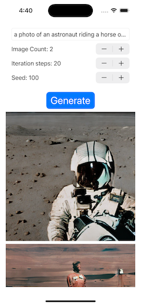

# Image Generator with Stable Diffusion v2


A minimal iOS app that generates images using Stable Diffusion v2.
You can create images specifying any prompt (text) such as "a photo of an astronaut riding a horse on mars".

- macOS 13.0 or newer, Xcode 14.1
- iPhone 12+ / iOS 16.2+, iPad Pro with M1/M2 / iPadOS 16.2+

You can run the app on above mobile devices.
And you can run the app on Mac, building as a Designed for iPad app.

The Xcode project does not contain the CoreML models of Stable Diffusion v2 (SD2).
So you need to make them converting the PyTorch SD2 models using Apple converter tools.

The project uses the Apple/ml-stable-diffusion Swift Package.
You can see how it works through the simple sample code.

- Apple/ml-stable-diffusion repo: https://github.com/apple/ml-stable-diffusion





## Convert CoreML models

Convert the PyTorch SD2 model to CoreML models, following Apple's instructions.

```bash
# create a Python environment and install dependencies
% conda create -n coremlsd2_38 python=3.8 -y
% conda activate coremlsd2_38
% cd SD2ModelConvChunked
% git clone https://github.com/apple/ml-stable-diffusion
% cd ml-stable-diffusion
pip install -e .
```

Visit the Hugging Face Hub - stabilityai/stable-diffusion-2 model's page.
（https://huggingface.co/stabilityai/stable-diffusion-2）
Check the Terms and Use and accept it. Then you can use the model.

And you need a Hugging Face's `User Access Token`, to download huggingface/models.
Please visit Hugging Face's site and make an access token at Account Settings.

```bash
# cli login
% huggingface-cli login
Token:    # <- input your Access Token
```

Download and convert the SD2 PyTorch model to CoreML models.
If you do this on a Mac/8GB memory, please close all running apps except Terminal,
otherwise the converter will be killed due to memory issues.

Use these options:
- `--model-version stabilityai/stable-diffusion-2-base` ... model version
- `--bundle-resources-for-swift-cli` ... compile and output `mlmodelc` files into `<output-dir>/Resources` folder. The Swift Package uses them.
- `chunk-unet` ... split the Unet model into two chunks for iOS/iPadOS execution.
- `--attention-implementation SPLIT_EINSUM` ... use SPLIT_EINSUM for Apple Neural Engine(ANE).

```bash
python -m python_coreml_stable_diffusion.torch2coreml --convert-unet --convert-text-encoder --convert-vae-decoder --convert-safety-checker -o sd2CoremlChunked --model-version stabilityai/stable-diffusion-2-base --bundle-resources-for-swift-cli --chunk-unet --attention-implementation SPLIT_EINSUM --compute-unit CPU_AND_NE
```

Drag and drop the CoreML model files into `CoreMLModels` folder in the project.

- `merges.txt, vacab.json, UnetChunk2.mlmodelc, UnetChunk1.mlmodelc, VAEDecoder.mlmodelc, TextEncoder.mlmodelc`

Now you can build the project, targeting to iPhone / iPad / My Mac (Designed for iPad)


## Consideration

- Large binary file: Since the model files are very large (about 2.5GB), it causes a large binary of the app.
The FAQ of Apple documentation says "The recommended option is to prompt the user to download 
these assets upon first launch of the app. This keeps the app binary size independent of the 
Core ML models being deployed. Disclosing the size of the download to the user is extremely 
important as there could be data charges or storage impact that the user might not be comfortable with.".

## References

- Apple Swift Package / ml-stable-diffusion: https://github.com/apple/ml-stable-diffusion
- Hugging Face Hub - stabilityai/stable-diffusion-2: https://huggingface.co/stabilityai/stable-diffusion-2


