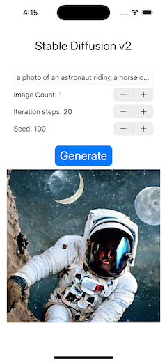

# Image Generator with Stable Diffusion v2

A minimal iOS app that generates images using Stable Diffusion v2.

The app uses

- stabilityai/Stable Diffusion v2 model, which was converted CoreML models using Apple's tool
- Apple / ml-stable-diffusion Swift Package (https://github.com/apple/ml-stable-diffusion#swift-requirements)

With the app, you can

- try the image generation with Stable Diffusion v2 and Apple's Swift Package
- see how the Apple / ml-stable-diffusion Library works

The project requires

- Xcode 14.1, macOS 13+
- iPhone 12+ iOS 16.2+ or iPad Pro/M1/M2 iPadOS 16.2+

Preparation

The coreml model files are too big to store in the GitHub repository. Git's file limitation is 100MB but the model files are total 2.5GB.
So the files were removed from the project.
You need to add the converted coreml model files yourself.

1. convert stabilityai/Stable-Diffusion-2-base PyTorch model to coreml models using Apple's tool.
2. add the files to the models2/Resources folder in the Xcode project.
- merges, TextEndoder, Unet, VAEDecoder, vocab

## Considerations

1. Chunked models: Chunked version, `UnetChunk1.mlmodelc` and `UnetChunk2.mlmodelc`, is better for iOS and iPadOS.
Follow the Apple's instructions. (https://github.com/apple/ml-stable-diffusion)
1. Large binary file: Since the model files are very large (about 2.5GB), it causes a large binary of the app.
The FAQ of Apple documentation says "The recommended option is to prompt the user to download 
these assets upon first launch of the app. This keeps the app binary size independent of the 
Core ML models being deployed. Disclosing the size of the download to the user is extremely 
important as there could be data charges or storage impact that the user might not be comfortable with.".

## References

- Apple Swift Package / ml-stable-diffusion: https://github.com/apple/ml-stable-diffusion

